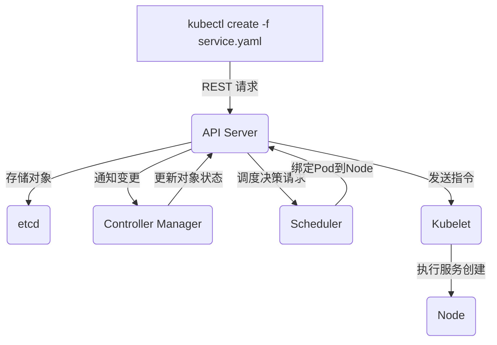

```mermaid
graph TD
    A[kubectl create -f service.yaml] -->|REST 请求| B(API Server)
    B -->|存储对象| C(etcd)
    B -->|通知变更| D(Controller Manager)
    B -->|调度决策请求| E(Scheduler)
    D -->|更新对象状态| B
    E -->|绑定Pod到Node| B
    B -->|发送指令| F(Kubelet)
    F -->|执行服务创建| G(Node)
```

