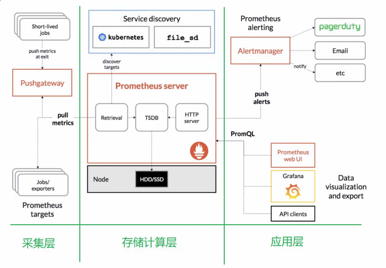

# what`s is the promtheus

​	Prometheus 是一个开源的系统监控和告警工具包，主要用于收集、存储和查询时间序列数据（时序数据库）。它采用拉模式从被监控目标获取数据，并支持灵活的查询语言 PromQL。

然而，Prometheus 仅作为时序数据库存在，需要与 Grafana、Alertmanager、Exporters 和 Pushgateway 等工具配合使用，以实现数据可视化、告警管理和数据推送等功能。

