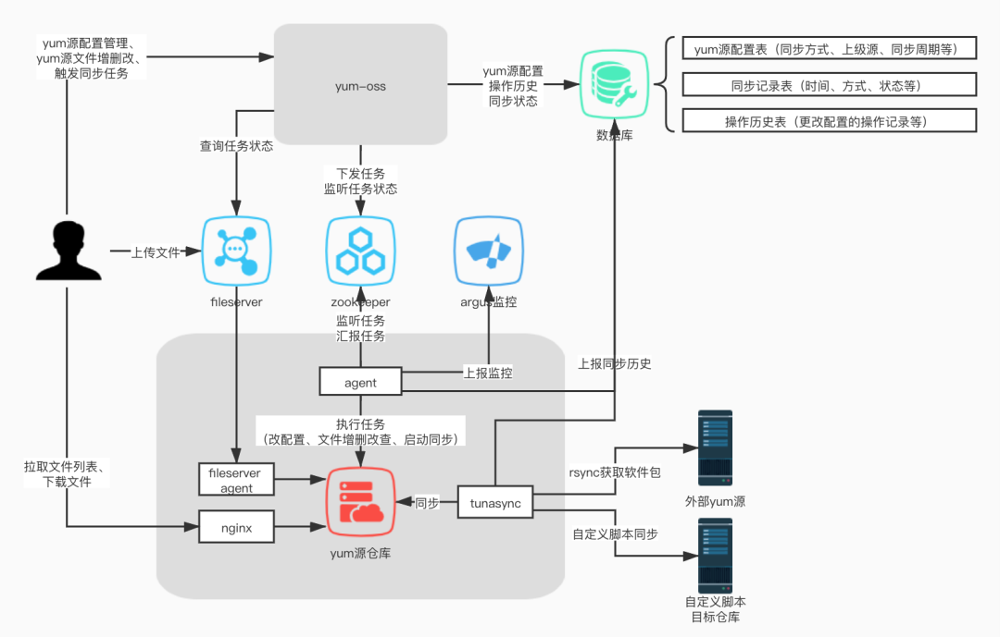

### 深入解析YUM源及其工作原理

#### YUM源的核心定义
YUM源（Yellowdog Updater Modified Repository）是专为RPM系Linux发行版设计的软件仓库体系，本质上是由元数据索引和RPM软件包构成的资源集合。该资源集合可部署于多种介质：
- 本地存储（ISO镜像/物理光盘）
- 网络服务（HTTP/FTP/NFS协议）
- 云存储（对象存储服务）

通过智能依赖解析机制，YUM能自动解决软件包依赖关系，形成完整的软件生态链。例如安装Apache服务时，YUM会自动检索并安装其依赖的SSL库、依赖解析模块等组件。

#### YUM架构深度解析
YUM系统采用C/S架构设计，具备双重功能模块：

**服务端架构要素**
- RPM存储库：结构化存储软件包及其版本信息
- 元数据生成：
  - 执行`createrepo`命令创建仓库索引
  - 生成repodata目录（包含primary.xml、filelists.xml等元数据文件）
  - 依赖关系图谱构建（通过requires/provides关系链）

**客户端工作流**
1. 元数据同步：
   - 读取`/etc/yum.repos.d/*.repo`配置
   - 下载repodata至`/var/cache/yum`缓存目录
2. 依赖解析：
   - 构建软件包依赖树
   - 计算最小化安装集合
3. 事务执行：
   - 下载RPM至`/var/cache/yum`缓存
   - RPM数字签名校验（需配置GPG密钥）
   - 执行pre/post安装脚本



#### YUM配置规范详解
配置文件存储于`/etc/yum.repos.d/`目录，建议采用分源配置策略（每源独立文件）。以下为增强型配置模板：

```ini
[baseos]  # 仓库标识符（需唯一）
name=CentOS Stream $releasever - BaseOS  # 人类可读名称
baseurl=https://mirrors.aliyun.com/centos-stream/$stream/BaseOS/$basearch/os/
        http://mirror.centos.org/centos/$stream/BaseOS/$basearch/os/
        file:///mnt/BaseOS  # 多URL容灾配置
enabled=1  # 启用状态
gpgcheck=1  # 安全验证开关
gpgkey=file:///etc/pki/rpm-gpg/RPM-GPG-KEY-centosofficial  # 密钥路径
skip_if_unavailable=False  # 网络不可用处理策略
metadata_expire=6h  # 元数据刷新周期
priority=1  # 源优先级（数值越小优先级越高）
```

**核心参数说明表**

| 参数        | 功能说明                         | 推荐值                       |
| ----------- | -------------------------------- | ---------------------------- |
| cost        | 访问成本系数（配合priority使用） | 100-2000                     |
| exclude     | 全局排除软件包列表               | kernel*                      |
| includepkgs | 白名单过滤                       | httpd-*                      |
| sslverify   | HTTPS证书验证                    | 1                            |
| proxy       | 代理服务器设置                   | http://proxy:port            |
| mirrorlist  | 动态镜像列表地址                 | http://mirrorlist.centos.org |

#### 企业级YUM源部署方案

##### 本地源建设标准流程
1. 介质准备：
   ```bash
   wget https://mirrors.aliyun.com/centos-stream/9-stream/BaseOS/x86_64/iso/CentOS-Stream-9-latest-x86_64-dvd1.iso
   md5sum CentOS-Stream-9-*.iso  # 校验完整性
   ```

2. 存储规划：
   ```bash
   mkdir -p /data/yum-repo/{BaseOS,AppStream}  # 企业级目录结构
   chmod 755 -R /data/yum-repo
   restorecon -Rv /data/yum-repo  # SELinux上下文修复
   ```

3. 智能挂载方案：
   ```bash
   # 创建持久化挂载配置
   echo "/opt/iso/CentOS-Stream-9-latest-x86_64-dvd1.iso /data/yum-repo/BaseOS iso9660 loop,ro,auto,nosuid 0 0" >> /etc/fstab
   mount -a  # 应用挂载配置
   ```

4. 仓库元数据重建：
   ```bash
   yum install -y createrepo
   createrepo --update --workers=8 /data/yum-repo/BaseOS  # 多线程重建索引
   ```

5. 客户端验证：
   ```bash
   yum clean all
   yum repolist -v  # 显示详细仓库信息
   yum install -y --downloadonly httpd  # 测试安装流程
   ```

##### 混合源配置策略
```ini
[local-base]
name=Local BaseOS
baseurl=file:///data/yum-repo/BaseOS
priority=1

[cloud-appstream]
name=Aliyun AppStream
baseurl=https://mirrors.aliyun.com/centos-stream/$stream/AppStream/$basearch/os/
priority=2
```

#### 高级运维技巧

1. **仓库健康检查**
   ```bash
   repoquery --repoid=baseos --all --queryformat="%{name}-%{version}-%{release}.%{arch}"
   yum check-update --nogpgcheck  # 跳过验证检查
   ```

2. **依赖关系可视化**
   ```bash
   yum deplist httpd | grep provider
   repoquery --requires --resolve httpd
   ```

3. **安全审计方案**
   ```bash
   rpm -Va $(rpm -qa | grep httpd)  # 校验文件完整性
   rpm --import /etc/pki/rpm-gpg/RPM-GPG-KEY-redhat-release
   ```

4. **增量同步方案**
   ```bash
   reposync --newest-only --download-metadata -p /data/yum-repo/
   createrepo --update /data/yum-repo/
   ```

#### 故障排除指南

**常见问题处理矩阵**

| 现象             | 诊断命令                     | 解决方案                       |
| ---------------- | ---------------------------- | ------------------------------ |
| 仓库元数据不可用 | `curl -I $baseurl/repodata`  | 检查网络连通性，验证目录权限   |
| GPG验证失败      | `rpm -q gpg-pubkey`          | 重新导入密钥文件               |
| 依赖解析冲突     | `package-cleanup --problems` | 使用`--skip-broken`参数跳过    |
| 缓存损坏         | `rm -rf /var/cache/yum`      | 清理缓存后重建                 |
| 镜像同步不完整   | `du -sh repodata/`           | 检查磁盘空间，重新生成仓库索引 |

通过以上优化方案，可构建出具备高可用性、安全可靠的企业级YUM源体系，满足不同规模IT环境的软件管理需求。
