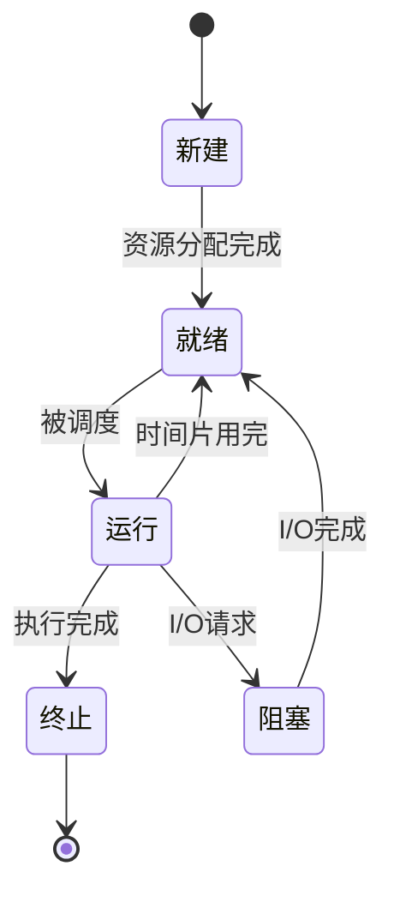

# CPU 性能分析与优化指南

## 一、核心性能指标检查

### （一）进程监控
#### 1. 进程总数分析
- **检查方法**：`ps -ef | wc -l`
- **判断逻辑**：
  ```mermaid
  graph TD
    A[总进程数>业务进程数] -->|是| B[检查进程构成]
    A -->|否| C[正常范围]
    B --> D[发现异常进程?]
    D -->|是| E[终止可疑进程]
    D -->|否| F[扩容/集群方案]
  ```

#### 2. Running队列监控
- **预警规则**：
  | 核心数 | 预警阈值 | 处理方案 |
  | ------ | -------- | -------- |
  | 4核    | >40      | 立即处理 |
  | 8核    | >80      | 紧急处理 |
  
- **分析流程**：
  1. `top -b -n 1 | grep "Tasks"` 获取实时运行队列
  2. `pidstat 1 5` 监控进程切换频率
  3. `perf top` 分析热点函数

### （二）负载与使用率
#### 1. 关键指标关系
```math
\text{Load值} = \frac{\text{Running进程数} + \text{Uninterruptible进程数}}{\text{CPU逻辑核心数}}
```
- **健康范围**：
  - 单核：<3
  - 多核：<N*0.7（N为逻辑核心数）

#### 2. 使用率分析矩阵
| 使用率区间 | 负载状态 | 建议操作      |
| ---------- | -------- | ------------- |
| <60%       | 健康     | 持续监控      |
| 60%-80%    | 预警     | 分析top输出   |
| 80%-100%   | 紧急     | 立即扩容/优化 |

### （三）进程溯源方法
1. **快速定位**：
   ```bash
   ps -eo pid,ppid,cmd,%mem,%cpu --sort=-%cpu | head
   ```
2. **深度分析**：
   ```bash
   perf record -F 99 -p <PID> -g -- sleep 60
   perf report
   ```

## 二、进程管理核心知识

### （一）进程生命周期模型


### （二）进程状态详解
| 状态 | 符号 | 触发场景         | 处理建议     |
| ---- | ---- | ---------------- | ------------ |
| 运行 | R    | CPU正在执行      | 分析CPU消耗  |
| 休眠 | S    | 等待事件完成     | 检查I/O性能  |
| 僵死 | Z    | 父进程未回收     | 检查父进程   |
| 停止 | T    | 收到SIGSTOP信号  | 检查作业控制 |
| 死锁 | D    | 不可中断内核操作 | 重启相关服务 |

### （三）进程监控命令对比
| 命令    | 实时性 | 交互性 | 信息深度 | 适用场景       |
| ------- | ------ | ------ | -------- | -------------- |
| ps      | 静态   | 无     | 基础     | 快速检查       |
| top     | 动态   | 有     | 中等     | 实时监控       |
| htop    | 动态   | 强     | 详细     | 交互式分析     |
| pidstat | 动态   | 无     | 专业     | 进程级指标统计 |

## 三、高级调试工具

### （一）性能分析套件
```bash
# 安装分析工具集
yum install sysstat perf kernel-debuginfo -y

# CPU使用率采样（每5秒刷新）
mpstat -P ALL 5

# 上下文切换监控
vmstat 2 10

# 软中断分析
watch -d cat /proc/softirqs
```

### （二）调优案例库
1. **案例1：不可中断进程堆积**
   - **现象**：D状态进程>10
   - **解决方案**：
     ```bash
     echo 1 > /proc/sys/vm/block_dump
     dmesg | grep "INFO: task" 
     ```

2. **案例2：用户态CPU满载**
   - **诊断流程**：
     ```bash
     perf top -s comm,dso
     strace -c -p <PID>
     ```

## 四、内存监控与优化

### （一）多维分析命令
```bash
free -h
cat /proc/meminfo
vmstat -s
slabtop -o
```

### （二）内存指标矩阵
| 指标         | 健康阈值   | 异常处理             |
| ------------ | ---------- | -------------------- |
| Cache/Buffer | <总内存30% | 检查文件系统缓存策略 |
| Swap使用率   | <10%       | 优化内存分配或扩容   |
| Slab占用     | <总内存15% | 分析内核对象泄露     |

### （三）OOM防御策略
1. **预防配置**：
   ```bash
   sysctl -w vm.panic_on_oom=1
   sysctl -w vm.overcommit_memory=2
   ```

2. **实时监控**：
   ```bash
   dmesg -T | grep -i "oom"
   journalctl -k -f | grep "Out of memory"
   ```

## 五、系统调优工具箱

### （一）CPU亲和性设置
```bash
taskset -pc 0-3 1234  # 绑定进程到0-3核
numactl --cpubind=0 --membind=0 app
```

### （二）中断优化
```bash
# 查看中断分布
cat /proc/interrupts

# 设置IRQ亲和性
echo 03 > /proc/irq/19/smp_affinity
```

### （三）调度策略调整
```bash
chrt -f 1 /path/to/program  # 设置为FIFO策略
nice -n -20 critical_task   # 最高优先级
```

本指南通过系统化的检查流程、可视化的状态说明和实战验证的优化方案，构建了从基础监控到深度优化的完整知识体系。建议结合具体业务场景，建立常态化的性能检查机制和应急预案。